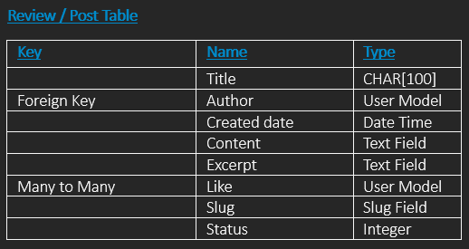
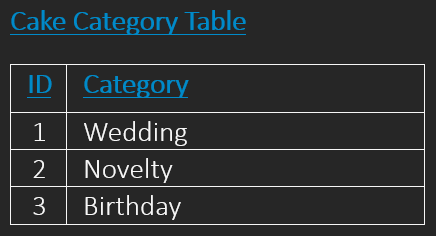
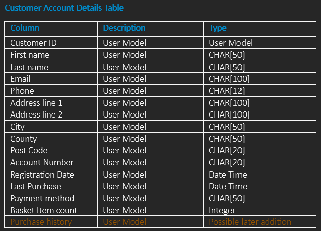

# *~Just Cakes ~*

*Just Cakes*, is a maker of beautiful cakes, that takes online orders and delivers across the UK.

Users of the site are able to create an account, browse a gallery of available cakes, search according to ingredients, flavours and diet choice, and choose dates for collection or delivery.

*Just Cakes* welcomes feedback and reviews from their customers on a dedicated page.
___
___

## Table of Contents

- [*~Just Cakes ~*](#just-cakes-)
- [Features:](#features)
- [List of Applications in product.](#list-of-applications-in-product)
- [Pre-requisites](#pre-requisites)
- [Project Planning \& Development](#project-planning--development)
- [Development Approach](#development-approach)
- [Other Development Choices](#other-development-choices)
- [Installation](#installation)
- [Use](#use)
- [Testing](#testing)
- [Conclusion](#conclusion)
- [Further Development](#further-development)
- [Deployment](#deployment)
- [Copy / Improve / Contribute](#copy--improve--contribute)
- [Credits, Acknowledgments and Appreciation.](#credits-acknowledgments-and-appreciation)


___
___

## Features:
- Gallery to browse a gallery of cakes.
- Registration with signup.
- Ability to create a customer profile.
- Ability to update and delete customer profiles.
- Ability to write reviews, comment on reviews, and delete reviews.
- Ability to add cake images and details via the Django admin.

## List of Applications in product.
- Customer Accounts
- Cakes
- Reviews
- Core (Dormant until further development)
- Orders (Dormant until further development)
___


## Pre-requisites

#### For basic functionality
```
Django==3.2.20
dj-database-url==0.5.0
psycopg2==2.9.7
django-allauth==0.55.0
Pillow==10.0.0
cloudinary==1.34.0
dj3-cloudinary-storage==0.0.6
django-cloudinary-storage==0.3.0
django-crispy-forms==1.14.0
django-summernote==0.8.20.0
gunicorn==21.2.0
whitenoise==6.5.0
```

## Project Planning & Development
### Database Modeling Tables

Reviews:


___

Table for planning **Cakes** database models

Defining type:Wedding, Novelty and Birthday. Allergy: GF for Gluten Free. V for plantbased.  Flavours and colors. And a list of the cakes themselves, making them searchable by users of the site.

Using Normalization to organize the data, so when changes to the data is required, it's more easily managed.





___

Table for planning **Customer Accounts** database models

___
## Development Approach

**Decision to Use Function-Based Views and Class-Based Views**.  As I've been developing this project, I've used both function based views and class based views. Initially I had a preference to class based because it's what was shown in the walk throughs, so it was "familiar".  But as I've progressed, I found myself less reliant on patterns of usage that I had learned.  And instead I found myself leaning toward function based views because I found them to be clearer to "me", for what I was wanting to do.  The models.py in each application have remained class based because it's more suited to django. Doubtless, as I progress, my need will change. I'll probably move back and forth between classes and functions according to the complexity of tasks.
As I've been developing this project, I've used both function based views and class based views. Initially I had a preference to class based because it's what was shown in the walk throughs, so it was "familiar".  But as I've progressed, I found myself less reliant on patterns of usage that I had learned.  And instead I found myself leaning toward function based views because I found them to be clearer to "me", for what I was wanting to do.  The models.py in each application have remained class based because it's more suited to django. Doubtless, as I progress, my need will change. I'll probably move back and forth between classes and functions according to the complexity of tasks.


### Other Development Choices
The Just Cakes project, at this stage is simple.  And the functionality could have been more condensed/streamlined.  But I'm purposely spread it out across applications within the main project because the will allow me to keep it structured as it further develops and I add more features down the line.

Hence applications that are currently dormant and functions where I've retained the framework but replaced the active logic with "TODO" placeholders, which will act as markers and guides for me or anyone else, for future development and implementations of these functionalities.

Bit of a learning curve whilst building this project.  Variables, by their nature are chosen names. So I've chosen those names according to what I believed to be suitable in describing what they are,  However, I've also learned that whilst you can choose whatever you want, some things are an agreed standard. And trying to stick to that has many benefits including readability and maintenance. As a result I've gone back and changed names of things. "pk" rather than "id" is one example.

The changing of names of has caused it's own confusion and problems. Despite this, I've chosen to go ahead with changes and will continue to do so as I encounter opportunities for standardization.

### Debugging Dilemmas: Uncovering Issues and Finding Solutions.

Issues with Navigation:
The display logic in the navigation (found within base.html) is controlled by an if/else conditional that checks two things.

1. If a user is authenticated/signed-in.
2. Whether the authenticated user has an associated customer account.

Unexpected issues came up when some users, despite being authenticated, did not display the "My Account" option.  I didn't think this should be possible because the signals.py script was written so that, when a user initially signs in using allauth, a customer account was automatically created and associated to that user.

Having users appearing without associated accounts and without the expected navigation was a bit confusing. To diagnose the problem, I added multiple span elements like:

`<span>1 User ID: {{ user.username }}</span>`
`<span>2 User ID: {{ user.username }}</span>`
`<span>3 User ID: {{ user.username }}</span>`

and so on, scattered throughout the navigation logic. This allowed me to track which elements were displayed under the different user states of: "not authenticated", "authenticated WITHOUT an associated account", and "authenticated WITH an associated account".

The idea being that an authenticated user with an associated account would see their username and a "My Account" link, whilst an authenticated user without an associated account would have an "Update Your Profile" link in the navigation.

Using the differently numbered and placed span elements, I finally realised that the only real issue was that the users I'd created via the Django admin panel bypassed the signals.py logic which would have automatically created an account and associated it with them.

Considering how this had come about, I decided that these were edge cases and didn't represent genuine user scenarios.
So I've streamlined the logic and removed the unnecessary complex parts.
This decision's grounded in the fact that all the "actual users" (those not created via the admin panel) would always have an associated account. This ensures consistency in the navigation for the user.

## Installation
**Note on Versioning**
It's crucial to use compatible versions of all dependencies to ensure that your project runs smoothly. In this guide, we are using Django version3.

### Install Django
Code: ```pip3 install 'django<4'```
Notes: Use Django 3.* to ensure compatibility and support.
Initialize the Django Project
Code: django-admin startproject PROJ_NAME .
Notes: The '.' at the end specifies that the project should be created in the current directory.
Create Django Apps
Code: ```python3 manage.py``` startapp APP_NAME
Notes: This will create a new app inside your Django project. Replace APP_NAME with your desired application name.
Running and Configuring the Server
Run the Django Development Server
Code: ```python3 manage.py runserver```

**Additional Information**
For more details, you can refer to the official [Django Documentation](https://www.djangoproject.com).
Register the App in Django Settings

**Prerequisites**
Check the list of required packages in the README file and make sure to install them.

**Also**, you can find guides and help here for:
- [How to deploy on Heroku](https://devcenter.heroku.com/categories/deployment)
- [How to use Cloudinary cloud based media service](https://cloudinary.com/documentation/how_to_integrate_cloudinary#:~:text=The%20best%20way%20to%20get,in%205%20minutes%20or%20less.)
- [How to use Managed PostgreSQL database hosting service](https://www.elephantsql.com/docs/index.html)

## Use

### User: sign-up / sign-in / sign-out
All handled by Allauth


___
___

## Testing


## Conclusion

___

## Further Development

Just Cakes is more the business name.  The application's aim is to create and hold accounts, ability to order/buy online.  Further development would be to add a "delivery application" which would tie in with other applications within the over all , holding many of their bits of information as foreign keys in it's own model.

It's because I plan to develop these aspects, I've purposely kept things quite separate.  So that when it's further developed, as aspects of it expand, they won't impinge on one another.  Hence, apparently redundant code such as 

___

## Deployment

___

### Copy / Improve / Contribute

If anyone wishes to copy and improve this software by contributing changes,
please do.  You will find instructions from
[GitHub on how to do this.]
___

## Credits, Acknowledgments and Appreciation.

The reviews application within the just cakes project has been copied from the Code Institute walkthrough django project "codestar".  

Picture images have been courtesy of Midjourney and Microsoft's Bing image-creator. Some I have 
I have used ChatGPT as a tutor that is on tap, asking it's advice about structure with a view to further development.
The things I needed to consider from a point of practicality and scalability in future development.  That's why there are parts that are dormant.

StackOverflow for regex patterns and advice on naming conventions.

The favicon.ico is courtesy of [Favicon Generator](https://favicon.io)

The wallpaper for the site was sourced as a svg file courtesy of [Hero Patterns](https://heropatterns.com/)
___
