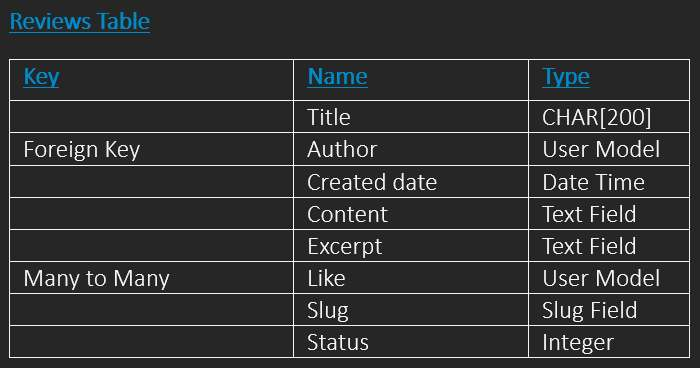
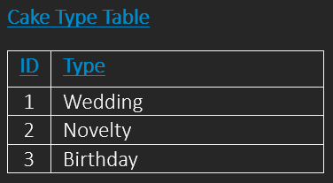
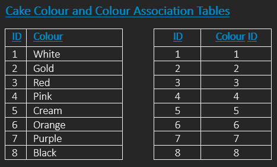
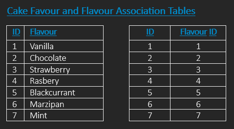

# *Just Cakes*

*Just Cakes*, is a maker of beautiful cakes, that takes online orders and delivers across the UK.

Users of the site are able to create an account, browse a gallery of available cakes, search according to ingredients, flavours and diet choice, and choose dates for collection or delivery.

*Just Cakes* welcomes feedback and reviews from their customers on a dedicated page.
___
___

## Table of Contents

- [Features](#features)
- [Project Planning & Development](#project-planning--development)
- [Dependencies and Required Packages](#dependencies-and-required-packages)
- [Installation](#installation)
- [Use](#use)
- [Testing of Functions](#testing-of-functions)
- [Further Development](#further-development)
- [Copy / Improve / Constribute](#copy--improve--constribute)
- [Credits, Acknowledgments and Appreciation-to](#credits-acknowledgments-and-appreciation-to)

___
___

## Features

___
## Project Planning & Development

- ### Apps required in project

    Table for planning **"Reviews"** database models.py

Tables used to plan model.py for cakes, defining type:Wedding, Novelty and Birthday. Allergy: GF for Gluten Free. V for plantbased.  Flavours and colours. And a list of the cakes themselves, making them searchable by users of the site.

## Prerequisites

___

## Dependencies and Required Packages

___

## Development & Code Quality Tools

___
___

## Installation

___

## Use

### User sign-in

___
___

## Testing of functions

## Conclusion

___

## Further Development

___

## Deployment

___

## Copy / Improve / Constribute

If anyone wishes to copy and improve this software by contributing changes,
please do.  You will find instructions from
[GitHub on how to do this.]
___

## Credits, Acknowledgments and Appreciation to

___
